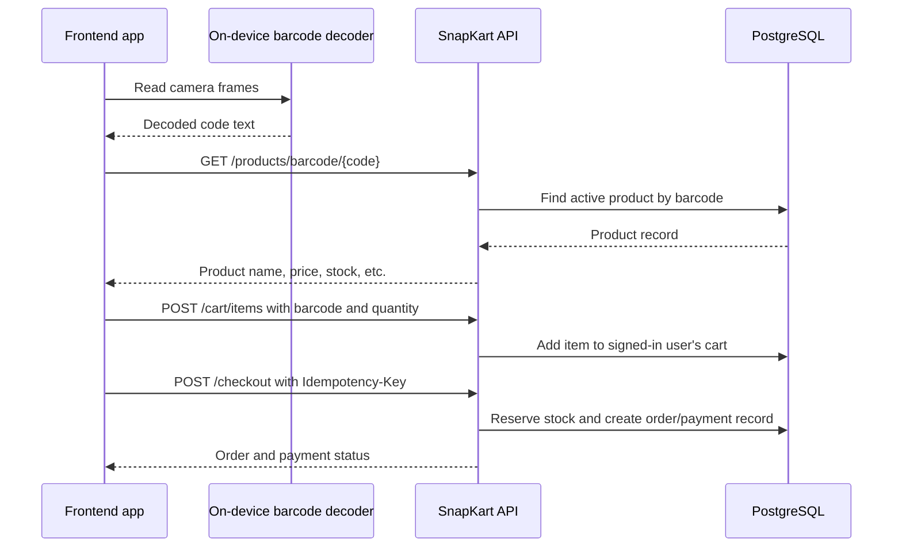

# SnapKart frontend and backend contract

This document is the integration guide for the frontend. The API is a TypeScript/Fastify modular monolith backed by PostgreSQL through Prisma. Auth, catalog, cart, checkout, payments, inventory, and admin functions are modules within the API process; the frontend talks to this API over HTTP and does not connect to PostgreSQL directly.

## Request conventions

- Local API base URL: `http://localhost:3000`
- Send and receive JSON unless an endpoint has no body.
- Protected endpoints require `Authorization: Bearer <token>`.
- Currency amounts are integer minor units. `5800` with currency `INR` is ₹58.00. Divide by 100 for display; send integer paise when writing prices.
- The API uses JSON error objects such as `{ "error": "PRODUCT_NOT_FOUND" }`.
- The default CORS origin is `http://localhost:5173`. Update `CORS_ORIGIN` if the frontend dev server uses another origin.

## Main scan-to-checkout flow



The camera decoder belongs in the frontend. It should return the decoded text from a barcode or QR code; the API takes that text and performs the product lookup. Do not upload camera photos for this flow. Ordinary barcode decoding does not require training a product-recognition model.

For development, `prisma/mock-products.json` contains 99 sample products with synthetic codes from `SNAPMOCK0001` to `SNAPMOCK0099`. Make QR labels (or Code 128 labels) containing those exact strings. The scanner must return the same string, and the frontend sends that value as the barcode. These mock codes are not printed on store products and must not be used as real retail UPC/EAN values.

## Data returned to screens

### Product

`GET /products/barcode/SNAPMOCK0001` returns:

```json
{
  "product": {
    "id": "database-product-id",
    "barcode": "SNAPMOCK0001",
    "name": "Whole Milk 1 L",
    "description": null,
    "category": "Dairy",
    "brand": "FreshFields",
    "supplier": "North Star Foods",
    "expiresAt": "2026-10-15T00:00:00.000Z",
    "priceMinor": 5800,
    "currency": "INR",
    "stock": 42,
    "active": true
  }
}
```

Use `product.id` for stable UI keys, `product.barcode` for scan/cart actions, `priceMinor` and `currency` for display, and `stock` to show availability. The product's price and stock from the API are authoritative; do not calculate or hard-code catalog prices in the frontend.

### Cart

`GET /cart` returns:

```json
{
  "id": "cart-id",
  "items": [
    {
      "productId": "database-product-id",
      "barcode": "SNAPMOCK0001",
      "name": "Whole Milk 1 L",
      "unitPriceMinor": 5800,
      "currency": "INR",
      "quantity": 2,
      "lineTotalMinor": 11600
    }
  ],
  "subtotalMinor": 11600
}
```

The frontend can display a subtotal by formatting `subtotalMinor` using the item's currency. The current API does not return tax, discounts, or shipping charges.

### Order

Checkout returns `{ "order": { ... } }`. The order includes `id`, `status`, `subtotalMinor`, `currency`, `createdAt`, item snapshots, and a payment object. The current mock payment provider normally returns `status: "PAID"` and payment `status: "SUCCEEDED"`.

## Endpoints by screen

| Frontend screen/action | Method and path | Auth | Body / result |
| --- | --- | --- | --- |
| Health check | `GET /health` | No | `{ "status": "ok" }` |
| Register | `POST /auth/register` | No | Body: `{ "email", "password", "name" }`; returns `{ "user", "token" }` |
| Sign in | `POST /auth/login` | No | Body: `{ "email", "password" }`; returns `{ "user", "token" }` |
| Current account | `GET /auth/me` | Yes | Returns `{ "user" }` |
| Browse/search catalog | `GET /products?q=&page=1&limit=20` | No | Returns `{ "items", "page", "limit", "total" }` |
| Look up scanned code | `GET /products/barcode/:barcode` | No | Returns `{ "product" }` |
| View cart | `GET /cart` | Yes | Returns cart object directly |
| Add scanned product | `POST /cart/items` | Yes | Body: `{ "barcode": "SNAPMOCK0001", "quantity": 1 }`; returns updated cart directly |
| Change quantity | `PATCH /cart/items/:cartItemId` | Yes | Body: `{ "quantity": 2 }`; returns `{ "ok": true }`. Refresh `GET /cart` after the update. |
| Remove item | `DELETE /cart/items/:cartItemId` | Yes | Returns HTTP `204` with no body |
| Pay/checkout | `POST /checkout` | Yes | Header: `Idempotency-Key: <unique value of 8–128 chars>`; returns `{ "order" }` |
| Order history | `GET /orders` | Yes | Returns `{ "items": [...] }` |
| Order details | `GET /orders/:orderId` | Yes | Returns `{ "order" }` |

Admin endpoints are listed below for a future admin screen. They require a user whose database role is `ADMIN`; public registration always creates `CUSTOMER` users.

| Admin screen/action | Method and path | Result |
| --- | --- | --- |
| Dashboard summary | `GET /admin/summary` | `{ "products", "customers", "orders", "revenueMinor" }` |
| Inventory table | `GET /admin/inventory?q=&lowStockAt=&page=1&limit=50` | `{ "items", "total", "page", "limit" }` |
| Create product | `POST /admin/products` | Body includes `barcode`, `name`, `priceMinor`; returns `{ "product" }` |
| Edit product | `PATCH /admin/products/:productId` | Returns `{ "product" }` |
| Adjust stock | `POST /admin/products/:productId/inventory-adjustments` | Body: `{ "delta": 5, "reason": "Stock received" }` |
| Order list | `GET /admin/orders?page=1&limit=20&status=PAID` | `{ "items", "total", "page", "limit" }` |

## Error and empty-state handling

- `404 PRODUCT_NOT_FOUND`: tell the user the code is not in this catalog. For the mock app, check that the exact synthetic code was seeded.
- `401 UNAUTHORIZED`: token missing/expired; return to sign-in and then reload the cart.
- `401 INVALID_CREDENTIALS`: show sign-in error.
- `409 INSUFFICIENT_STOCK`: explain that the available quantity changed and refresh the product/cart.
- `400 EMPTY_CART`: do not allow checkout when the cart has no items.
- `400 IDEMPOTENCY_KEY_REQUIRED`: checkout must send a unique key; reuse the same key if retrying that same checkout request.
- `402`: payment was declined by the configured provider. The local mock provider normally succeeds.
- `202`: payment result is pending; show pending status and check order history before retrying payment.

## Current scope and integration limits

- The payment provider is simulated. No real payment method or card details are accepted.
- The backend uses the seeded catalog for exact barcode lookup. It does not call Open Food Facts or another external product database.
- Admin routes exist, but there is no admin UI or public admin-promotion endpoint.
- The seed interprets workbook prices as INR because no currency was specified. Confirm that assumption before using values beyond mock development.
